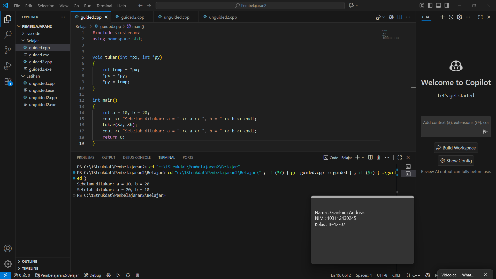

# <h1 align="center">Laporan Praktikum Modul 2 <br> Pengenalan C++ Part 2</h1>
<p align="center">GIANLUIGI ANDRAES PUTRA BUTARBUTAR - 103112430245</p>

## Dasar Teori

#### 1. Konsep Array
   
Array atau larik bisa dibilang sebagai tempat penyimpanan data yang sejenis dalam satu variabel. Jadi daripada bikin banyak variabel buat nyimpen data yang sama tipenya, kita cukup pakai satu array aja. Setiap data di dalam array punya posisi (indeks) sendiri yang dimulai dari 0. Ukuran array harus ditentukan dari awal (pas deklarasi), dan ukurannya nggak bisa diubah selama program dijalankan karena sifatnya yang statis.

##### A. Array Satu Dimensi (1D)

Array satu dimensi itu bisa dibilang sebagai kumpulan data yang disusun secara linear, dan tiap elemennya bisa diakses pakai satu indeks aja. Biasanya dipakai buat menyimpan data sejenis, misalnya daftar nilai atau umur mahasiswa.
```
Deklarasi: 
tipe_data nama_array[ukuran];
```
```
Contoh:
int nilai[10]; (artinya kita bikin array bernama nilai yang bisa menampung 10 data bertipe integer, dari nilai[0] sampai nilai[9]).
```

##### B. Array Dua Dimensi (2D)

Kalau array satu dimensi bentuknya kayak barisan data, maka array dua dimensi bentuknya udah mirip tabel atau matriks — punya baris dan kolom. Jadi untuk ngakses satu data, kita butuh dua indeks: satu buat baris, satu lagi buat kolom.

```
Deklarasi: tipe_data nama_array[baris][kolom];
```
```
Contoh: float matriks[3][4]; (berarti kita punya array 2D dengan 3 baris dan 4 kolom, yang bisa dianggap kayak tabel berisi angka pecahan (float)). 
```

#### 2. Parameter Fungsi dan Mekanisme Pelewatan
   
Dalam C++, fungsi atau prosedur itu semacam subprogram kecil yang bisa menerima data dari luar lewat parameter. Nah, cara data dikirim dari program utama ke fungsi inilah yang disebut mekanisme pelewatan parameter. Secara umum, ada tiga cara utama: Call by Value, Call by Reference, dan Call by Pointer.

##### A. Call by Value (Pelewatan Nilai)

Pada cara ini, nilai dari variabel asli disalin ke parameter di dalam fungsi. Jadi perubahan yang terjadi di dalam fungsi nggak akan ngaruh ke variabel aslinya.

Ciri khasnya: variabel di fungsi cuma “copy-an” dari variabel aslinya.

```cpp
void tambah(int a) {
    a = a + 10;
}
```

##### B. Call by Reference (Pelewatan Acuan)

Nah kalau yang ini beda, karena fungsi bisa langsung mengubah isi variabel aslinya. Yang dikirim ke fungsi bukan salinan nilainya, tapi “alamat” atau referensi ke variabel tersebut.

Implementasi: tambahkan tanda ampersand (&) setelah tipe data di parameter.

```cpp
void tukar(int &a, int &b) {
    int temp = a;
    a = b;
    b = temp;
}
```

Efek: Perubahan pada parameter formal di dalam fungsi secara langsung memengaruhi nilai variabel aktual di program pemanggil.

##### C. Call by Pointer (Pelewatan Alamat)

Mekanisme ini mirip dengan call by reference, tapi cara kerjanya menggunakan pointer — yaitu variabel yang nyimpen alamat memori dari variabel lain.

Konsep Pointer:

- Pointer (*) adalah variabel yang menyimpan alamat memori.

- Operator & (Address-of) digunakan untuk mendapatkan alamat variabel.

- Operator * (Dereference) digunakan untuk mengakses atau memanipulasi nilai yang berada di alamat yang ditunjuk oleh pointer.

Implementasi:

```cpp
void tukar(int *a, int *b) {
    int temp = *a;
    *a = *b;
    *b = temp;
}

// Pemanggilan:
tukar(&x, &y);
```

Efek: Fungsi dapat memanipulasi nilai variabel aktual dengan menggunakan operator dereference (*) pada pointer formal, karena mereka bekerja pada lokasi memori yang sama.

Baik Call by Reference maupun Call by Pointer sama-sama memungkinkan fungsi untuk memodifikasi variabel asli. Dua cara ini sangat berguna ketika kita bekerja dengan array besar atau struktur data kompleks, karena lebih efisien data tidak perlu disalin, cukup dilewatkan alamatnya saja.


## Guided

### Soal 1

Program ini dibuat untuk menukar nilai dari dua variabel menggunakan fungsi dan pointer. Proses penukaran dilakukan lewat alamat memori variabel, bukan lewat salinan nilainya, jadi nilai aslinya benar-benar berubah setelah fungsi dijalankan.

Tujuan dari program ini adalah supaya kita bisa paham cara kerja call by pointer di C++, yaitu cara memanggil fungsi dengan mengirim alamat variabel agar bisa diubah langsung dari dalam fungsi.

Dengan program ini, kita bisa lihat perbedaan antara penyalinan nilai biasa dan pengubahan nilai lewat alamat memori. Jadi, konsep pointer ini penting karena bikin fungsi bisa ngubah data asli tanpa harus ngembaliin nilai.

```cpp
#include <iostream>
using namespace std;


void tukar(int *px, int *py)
{
    int temp = *px;
    *px = *py;
    *py = temp;
}

int main()
{
    int a = 10, b = 20;
    cout << "Sebelum ditukar: a = " << a << ", b = " << b << endl;
    tukar(&a, &b);
    cout << "Setelah ditukar: a = " << a << ", b = " << b << endl;
    return 0;
}
```

> Output
> 


### Soal 2

Aku mengerjakan program C++ yang berfungsi untuk menukar nilai dua buah variabel menggunakan fungsi dengan parameter bertipe reference.
Berbeda dengan program sebelumnya yang memakai pointer, program ini menggunakan konsep call by reference, di mana variabel asli langsung “direferensikan” ke parameter fungsi tanpa perlu menggunakan tanda & saat pemanggilan.

Singkatnya program ini menggunakan konsep call by reference, di mana variabel yang dikirim ke fungsi tidak disalin, tetapi langsung direferensikan.
Dengan cara ini, perubahan nilai di dalam fungsi akan langsung berdampak pada variabel aslinya.

```cpp
#include <iostream>
using namespace std;

void tukar(int &x, int &y)
{
    int temp = x;
    x = y;
    y = temp;
}

int main()
{
    int a = 10, b = 20;
    cout << "Sebelum ditukar: a = " << a << ", b = " << b << endl;
    tukar(a, b);
    cout << "Setelah ditukar: a = " << a << ", b = " << b << endl;
    return 0;
}
```

> Output
> 

## Unguided

### Soal 1

Buatlah sebuah program untuk melakukan transpose pada sebuah matriks persegi berukuran 3x3. Operasi transpose adalah mengubah baris menjadi kolom dan sebaliknya. Inisialisasi matriks awal di dalam kode, kemudian buat logika untuk melakukan transpose dan simpan hasilnya ke dalam matriks baru. Terakhir, tampilkan matriks awal dan matriks hasil transpose. 

Contoh Output: 

```
Matriks awal :

1 2 3
4 5 6
7 8 9 

Matriks hasil transpose:

1 4 7
2 5 8
3 6 9
```

```cpp
#include <iostream>
using namespace std;

int main() {
    int matriks[3][3] = {
        {1, 2, 3},
        {4, 5, 6},
        {7, 8, 9}
    };

    int transpose[3][3];

    for (int i = 0; i < 3; i++) {
        for (int j = 0; j < 3; j++) {
            transpose[j][i] = matriks[i][j];
        }
    }

    cout << "Matriks awal :" << endl;
    for (int i = 0; i < 3; i++) {
        for (int j = 0; j < 3; j++) {
            cout << matriks[i][j] << " ";
        }
        cout << endl;
    }

    cout << endl;

    cout << "Matriks hasil transpose :" << endl;
    for (int i = 0; i < 3; i++) {
        for (int j = 0; j < 3; j++) {
            cout << transpose[i][j] << " ";
        }
        cout << endl;
    }

    return 0;
}

```

> Output
> 

> Penjelasan

Program ini membuktikan bahwa operasi transpose berhasil dilakukan, yaitu dengan menukar baris menjadi kolom. Dengan teknik loop bersarang (for ganda), program dapat menyalin elemen dari matriks awal ke matriks hasil transpose dengan indeks yang ditukar.

1. Inisialisasi Matriks
   
```cpp
int matriks[3][3] = {
    {1, 2, 3},
    {4, 5, 6},
    {7, 8, 9}
};
```

Sesuai dengan soal, bahwa matriks awal di inisialisasi didalam kode, maka matriks awal ditentukan langsung di dalam kode program. Isinya adalah angka 1–9 dalam bentuk 3 baris dan 3 kolom.

2. Membuat Matriks Transpose
   
```cpp
int transpose[3][3];
```

Setelah itu menyediakan array 2 dimensi kosong untuk menyimpan hasil transpose.

3. Logika Transpose

```cpp
for (int i = 0; i < 3; i++) {
    for (int j = 0; j < 3; j++) {
        transpose[j][i] = matriks[i][j];
    }
}
```

- Struktur Perulangan Ganda

Program menggunakan dua perulangan bersarang (nested loop) yaitu:

```
for (int i = 0; i < 3; i++)
```

Berfungsi untuk mengakses setiap baris dari matriks awal dengan indeks baris i = 0, 1, 2.

```
for (int j = 0; j < 3; j++)
```

Berfungsi untuk mengakses setiap kolom di dalam baris ke-i dengan Indeks kolom j = 0, 1, 2.

Kombinasi dua loop ini memungkinkan kita menjangkau seluruh elemen matriks satu per satu.

- Mekanisme di Dalam Memori

Secara konsep memori:

```
matriks[i][j] diakses terlebih dahulu, setelah itu Nilainya disalin ke transpose[j][i].
```

Karena array dua dimensi itu disimpan baris per baris di memori, operasi ini tidak mengubah urutan data di memori aslinya, melainkan membuat salinan ke struktur array lain (transpose) dengan pola posisi yang ditukar.

- Kesimpulan Logika

Loop pertama (i) yaitu untuk mengontrol baris yang sedang diproses dan loop kedua (j) yaitu untuk mengontrol kolom dalam baris tersebut.

Dengan menukar posisi indeks [i][j] menjadi [j][i], kita menukar posisi baris dan kolom.

Hasil akhir adalah matriks baru yang merupakan cerminan diagonal utama dari matriks awal.

4. Menampilkan Matriks Awal dan Transpose

Menggunakan loop ganda untuk mencetak isi matriks baris per baris dan setelah itu, menampilkan kedua matriks agar terlihat perbedaan sebelum dan sesudah transpose.

### Soal 2

Buatlah program yang menunjukan penggunaan call by reference. Buat sebuah prosedur bernama kuadratkan yang menerima satu parameter integer secara referensi(&). Prosedur ini akan mengubah nilai asli variabel yang dilewatkan dengan nilai kuadratnya. Tampilkan nilai variabel di main() sebelum dan sesudah memanggil prosedur untuk membuktikan perubahannya.

Contoh Output:

```
Nilai awal: 5
Nilai setelah dikuadratkan: 25
```

```cpp
#include <iostream>
using namespace std;

void kuadratkan(int &x) {
    x = x * x;  
}

int main() {
    int angka;

    cout << "Nilai Awal: ";
    cin >> angka;

    kuadratkan(angka);

    cout << "Nilai setelah dikuadratkan: " << angka << endl;

    return 0;
}
```

> Output
> 

> Penjelasan

Program ini berfungsi untuk menguadratkan sebuah bilangan, tetapi dengan tujuan utama yaitu menunjukkan penerapan konsep Call by Reference dalam C++ melalui fungsi kuadratkan() yang mengubah nilai asli variabel menjadi hasil kuadratnya, serta membuktikan bahwa perubahan nilai terjadi secara langsung tanpa perlu nilai kembalian dari fungsi.

1. Prosedur kuadratkan

```cpp
void kuadratkan(int &x) {
    x = x * x;
}
```

Prosedur ini menerima parameter dengan tanda & yang artinya adalah call by reference. Call by reference berarti prosedur tidak membuat salinan variabel baru, tetapi langsung mengacu ke alamat memori variabel asli.

Pada code operasi _x = x * x;_ code akan langsung mengubah nilai asli variabel yang dipanggil di main().

2. Fungsi main()

```cpp
int angka;
cout << "Masukkan sebuah bilangan: ";
cin >> angka;
```

   Di dalam fungsi main(), pertama program akan mengeluarakan perintah kepada user menggunakan fungsi cout, setelah itu user memasukkan sebuah bilangan bulat ke variabel angka.

```cpp
kuadratkan(angka);
```

Setelah user melakukan input, program masuk ke pemanggilan prosedur menggunakan call by reference. Variabel angka langsung berubah nilainya menjadi kuadrat dari bilangan semula.

```cpp
cout << "Nilai setelah dipanggil prosedur kuadratkan: " << angka << endl;
```

Setelah proses prosedur telah selesai, program menampilkan nilai angka, dimana angka sudah berubah menjadi kuadrat.

## Referensi

1. https://en.wikipedia.org/wiki/Data_structure
2. https://www.w3schools.com/cpp/cpp_arrays.asp
